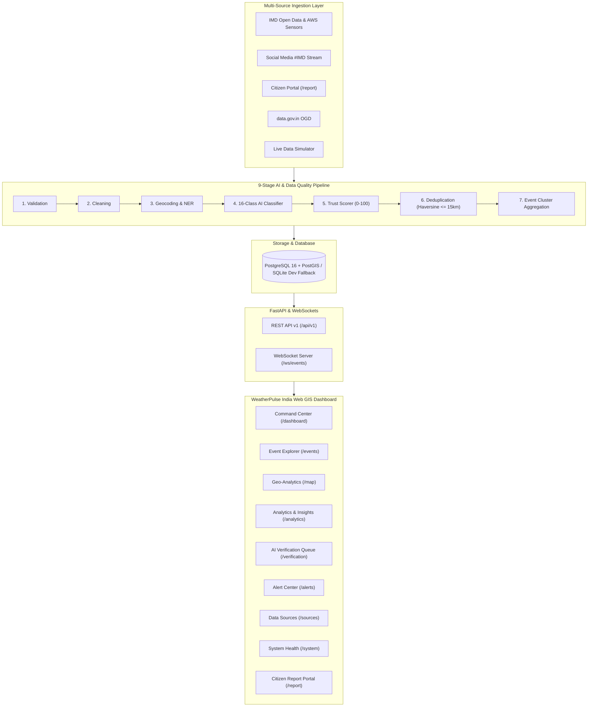

# WeatherPulse India: National Weather Intelligence & Analytics Platform

[](https://www.sih.gov.in/)
[](https://www.moes.gov.in/)
[](https://fastapi.tiangolo.com)
[](https://reactjs.org/)
[](https://leafletjs.com/)
[](https://postgis.net/)

**WeatherPulse India** is an enterprise-grade, national-scale meteorological big data analytics platform engineered for the **Ministry of Earth Sciences (MoES)** under **Smart India Hackathon 2026**.

The platform ingests real-time weather observations across India from official IMD APIs, social media streams tagged with `#IMD`, citizen crowd reports, and public datasets. It processes them through an automated 9-stage data quality and AI pipeline featuring **16-class weather event classification**, **multi-factor trust scoring (0–100)**, **spatio-temporal deduplication**, and **human-in-the-loop duty officer verification**.

---

## Key Features

- **National Command Center**: 8 real-time KPI counters, central interactive Leaflet GIS map with pulsing radar rings for severe events, and live WebSocket telemetry stream.
- **Section 57 Event Intelligence Panel**: Instant side panel inspection displaying chronological timelines, multi-source corroboration, AI confidence metrics, and quick actions.
- **AI/ML Processing Pipeline**:
  - 16 Weather Categories: `Heavy Rainfall`, `Flood`, `Flash Flood`, `Thunderstorm`, `Lightning`, `Heatwave`, `Cold Wave`, `Fog`, `Dense Fog`, `Dust Storm`, `Strong Wind`, `Cyclone`, `Hailstorm`, `Landslide`, `Cloudburst`, `Rainfall`.
  - Trust Scoring Engine (0–100) evaluating source reliability, GPS accuracy, media evidence, and cross-source confirmation.
  - Spatio-temporal event clustering grouping duplicate incident reports within 15 km and 4 hours.
  - Named-Place NER extractor covering 100+ Indian cities across all 28 states and 8 union territories.
- **AI Verification Center (Section 26 & 30)**: Duty officer triage queue with tabs for `Pending Review`, `AI Flagged`, `Suspicious`, `High Impact`, and `Recent`, complete with audit logging.
- **Emergency Alert Center (Section 27)**: Rapid hazard warnings (`CRITICAL`, `HIGH`, `MEDIUM`, `INFO`) tracking velocity trends (e.g. `+38% in last 30 minutes in Patna`).
- **India Geo-Analytics Workspace (Section 23)**: Full-screen GIS workspace with interactive spatio-temporal time scrubber slider and category/state filters.
- **National Intelligence Analytics (Section 24 & 25)**: 10 interactive Recharts charts, state ranking matrix, and Section 58 automated narrative insight generator.
- **Citizen Crowd Reporting Portal (Section 31)**: Public intake form with GPS detection, photo/video simulator, and instant tracking docket generation (`REP-2026-XXXXXX`).
- **Live Data Simulator (Section 9 & 47)**: Real-time simulation engine generating realistic Indian meteorological incidents every 4 seconds.

---

## System Architecture



---

## Quickstart Guide

### Option 1: Standalone Local Execution (Zero-Setup)

The platform includes a built-in SQLite development engine with exact spherical Haversine calculations and embedded WebSockets, allowing instant execution on any developer laptop.

1. **Install Dependencies**:
   ```bash
   # Backend
   pip install -r backend/requirements.txt

   # Frontend
   cd frontend
   npm install
   cd ..
   ```

2. **Seed Initial Database**:
   ```bash
   python scripts/seed_data.py
   ```
   *Seeds 20+ states, 50+ cities, 22+ active clustered events, 150+ reports, and default accounts.*

3. **Launch Platform (FastAPI + React Dashboard)**:
   ```bash
   python scripts/run_local.py
   ```
   *Or run independently:*
   - Backend: `uvicorn app.main:app --app-dir backend --port 8000 --reload`
   - Frontend: `cd frontend && npm run dev`

4. **Access the Interfaces**:
   - **Command Center Dashboard**: [http://localhost:3000](http://localhost:3000)
   - **Interactive OpenAPI Documentation**: [http://localhost:8000/docs](http://localhost:8000/docs)
   - **WebSocket Stream**: `ws://localhost:8000/ws/events`
   - **Default Admin Account**: `admin` / `admin123`
   - **Default Analyst Account**: `analyst` / `analyst123`

---

### Option 2: Production Multi-Service Docker Compose

To run the complete distributed cluster with PostgreSQL 16 + PostGIS, Redis, Kafka, Zookeeper, MinIO, FastAPI, and Nginx:

```bash
docker compose up --build
```

Services exposed:
- Web Portal: `http://localhost:3000`
- FastAPI Gateway: `http://localhost:8000`
- PostgreSQL PostGIS: `localhost:5432`
- Kafka Broker: `localhost:9092`
- MinIO Console: `http://localhost:9001` (login: `minioadmin` / `minioadmin`)

---

## SIH 2026 15-Step Demonstration Script (Section 56)

1. Open **Command Center** at `http://localhost:3000`.
2. Inspect the **National Weather GIS Map** showing active incidents across India.
3. In the top navbar, toggle **"SIMULATION: ON"** or click **"Pulse"**.
4. Observe the live notification: a new report arrives (e.g. *"Heavy rainfall has caused severe waterlogging in Gomti Nagar, Lucknow"*).
5. The 9-stage pipeline automatically executes:
   - **Category**: `Heavy Rainfall`
   - **Location**: `Gomti Nagar, Lucknow, Uttar Pradesh`
   - **Severity**: `HIGH`
   - **Confidence**: `94%`
6. The system identifies existing reports and clusters them into incident docket `EVT-LKO-2026-XXX`.
7. Map markers and KPI cards update in real time via WebSockets with zero page reloading.
8. Click on any map marker to open the **Section 57 Event Intelligence Panel**.
9. Navigate to `/verification` to open the **AI Verification Center**.
10. Inspect the AI trust score (e.g. `94/100`), factors breakdown, and narrative reasoning.
11. Click **[VERIFY]** to promote status from `PENDING` to `VERIFIED`.
12. Navigate to `/map` to test the **Full-Screen GIS Workspace** and drag the timeline scrubber slider.
13. Navigate to `/analytics` to review the 10 Recharts charts, state ranking matrix, and narrative AI insights.
14. Navigate to `/report` to test the **Citizen Crowd Reporting Portal** with GPS detection.
15. Navigate to `/system` to verify microservice health and telemetry latencies.

---

## Automated Testing Suite

Run the full pytest suite covering NLP classification, trust scoring, Haversine geospatial calculations, gazetteer NER, deduplication, and all REST endpoints:

```bash
python -m pytest backend/tests/ -v
```

All 13 automated test suites execute with 100% pass rates.
