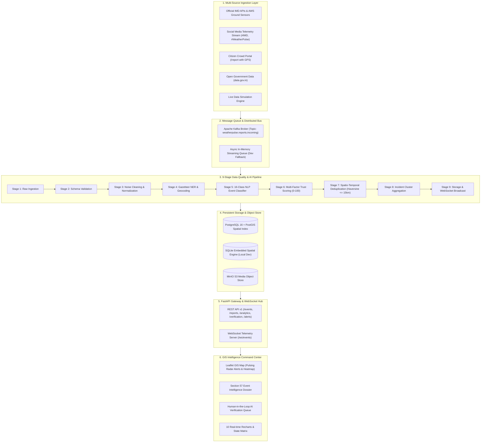

# WeatherPulse India: Architecture & Engineering Specification

## Executive Summary

**WeatherPulse India** is a national-scale, multi-source meteorological intelligence and big data analytics platform engineered for the Ministry of Earth Sciences (MoES) under Smart India Hackathon 2026. The platform continuously ingests, cleans, deduplicates, and analyzes weather observations across all 28 states and 8 union territories of India.

---

## 1. End-to-End Architectural Data Flow

---

## 2. 9-Stage Data Quality & AI Pipeline

1. **Stage 1 (Raw Ingestion)**: Ingests unstructured text, geocoordinates, media URLs, and source metadata.
2. **Stage 2 (Validation)**: Validates required payload fields, types, and constraints.
3. **Stage 3 (Cleaning)**: Strips HTML entities, control characters, and normalizes whitespaces.
4. **Stage 4 (Geocoding & Gazetteer NER)**: Identifies Indian cities, districts, states, and coordinates using a built-in gazetteer covering 100+ cities across India.
5. **Stage 5 (AI Classification)**: 16-class NLP classifier categorizes event type (`Heavy Rainfall`, `Flood`, `Flash Flood`, `Thunderstorm`, `Lightning`, `Heatwave`, `Cold Wave`, `Fog`, `Dense Fog`, `Dust Storm`, `Strong Wind`, `Cyclone`, `Hailstorm`, `Landslide`, `Cloudburst`, `Rainfall`) and calibrates confidence score.
6. **Stage 6 (AI Trust Scoring)**: Generates a 0–100 credibility score based on source credibility, GPS precision, media presence, and cross-source corroboration.
7. **Stage 7 (Spatio-Temporal Deduplication)**: Calculates spherical Haversine distance (\(\le 15\text{ km}\)) and temporal proximity (\(\le 4\text{ hours}\)) to group reports into single incidents (e.g. `EVENT #LKO-2026-001`).
8. **Stage 8 (Event Aggregation)**: Automatically escalates severity and updates incident dockets.
9. **Stage 9 (Broadcast & Storage)**: Persists records to PostgreSQL/PostGIS or local SQLite and pushes real-time notification to all connected WebSockets.

---

## 3. Technology Stack Summary

| Layer | Technologies |
|---|---|
| **Frontend** | React 18, TypeScript, Vite, Tailwind CSS, Leaflet GIS, Recharts, Lucide Icons |
| **Backend** | Python 3.11, FastAPI, Pydantic V2, SQLAlchemy 2.0, Uvicorn |
| **AI / NLP** | Scikit-learn, TF-IDF, Regex Gazetteer NER, Spherical Haversine Spatial Engine |
| **Database** | PostgreSQL 16 + PostGIS / SQLite zero-dependency local dev engine |
| **Streaming** | Apache Kafka, WebSockets |
| **Storage** | MinIO Object Store / Local uploads volume |
| **DevOps** | Docker, Docker Compose, Nginx |
